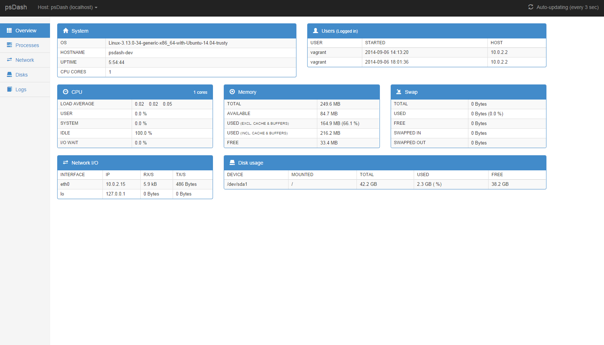
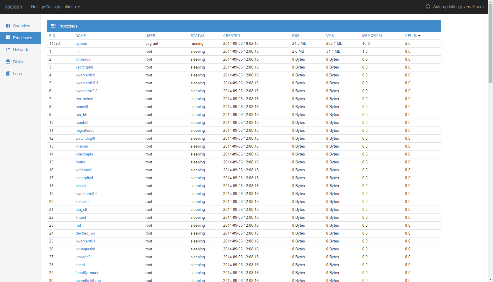
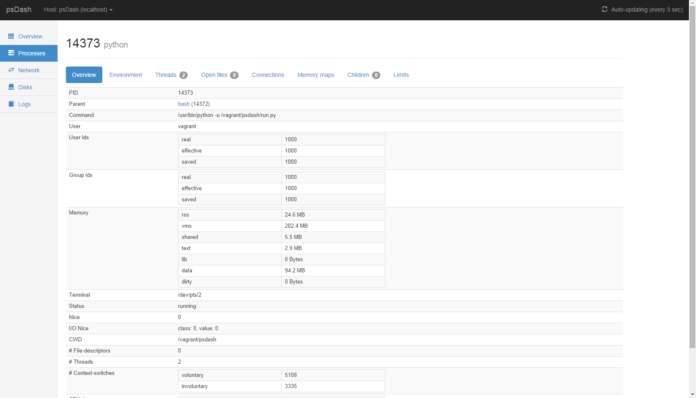
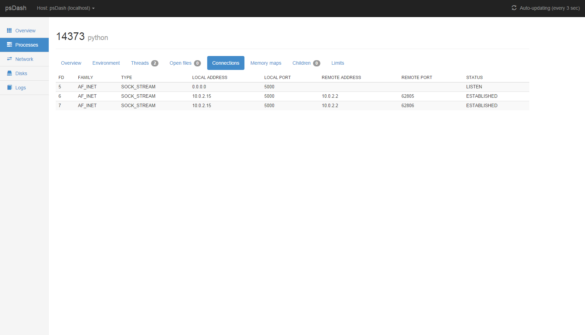
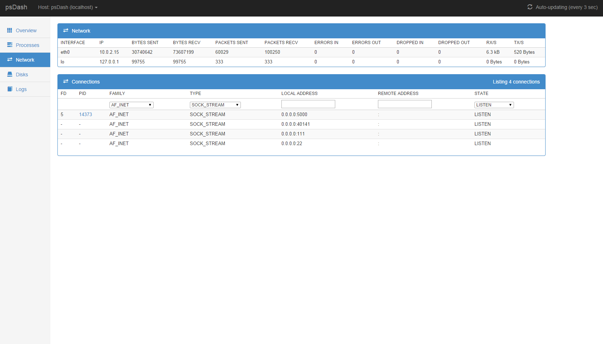
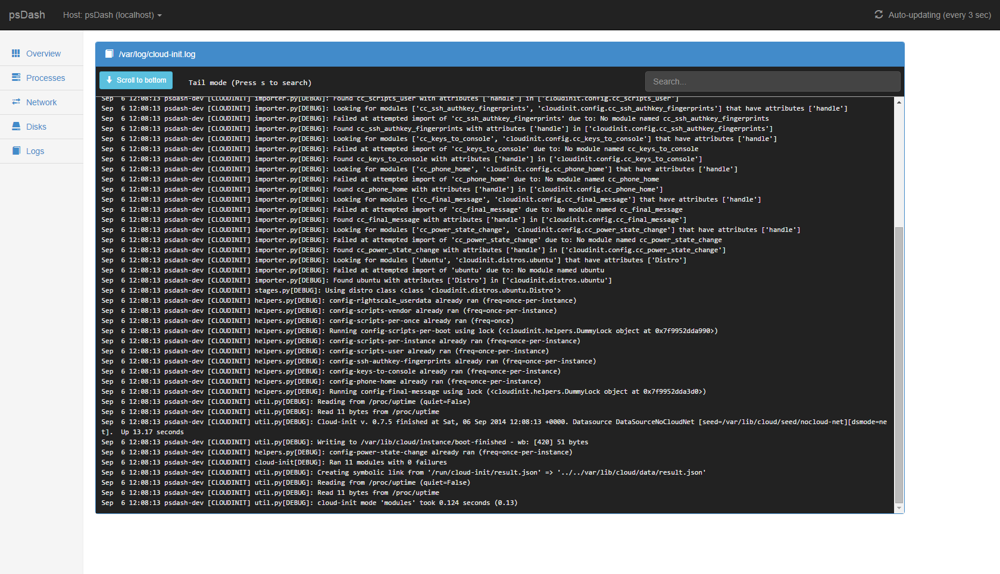
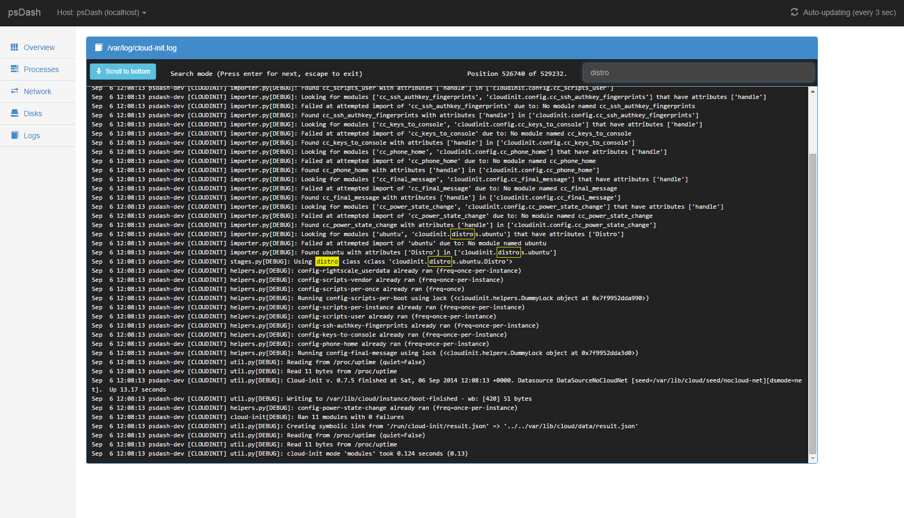

# psdash

psdash is a system information web dashboard for linux using data mainly served by [psutil](https://code.google.com/p/psutil/) - hence the name.

Features includes:
* **Overview**<br>
  Dashboard overview of the system displaying data on cpu, disks, network, users, memory, swap and network.
* **Processes**<br>
    List processes (`top` like) and view detailed process information about each process.

    Apart from a detailed process overview this is also available for each process:
    * Open files
    * Open connections
    * Memory maps
    * Child processes
    * Resource limits
* **Disks**<br>
    List info on all disks and partitions
* **Network**<br>
    List info on all network interfaces and the current throughput.
* **Logs**<br>
    Tail and search logs
* **All data is updated automatically, no need to refresh**

The GUI is pretty much a modified bootstrap example as I'm no designer at all.
If you got a feel for design and like to improve the UI parts of psdash, please create a pull request with your changes.
It would be much appreciated as there's much room for improvements.

## Getting started

Installation using pip:<br>
`pip install psdash`

Since pip [1.5.1](https://github.com/pypa/pip/issues/1423) you are forced to add `--allow-external argparse` since the latest argparse is hosted on google code.

Installation from source:<br>
`python setup.py install`

Starting psdash:<br>
`psdash --log /var/log/myapp.log --log /var/log/mydb.log`

Available command-line arguments:
```
usage: psdash [-h] [-l path] [-b host] [-p port] [-d]

psdash 0.3.0 - system information web dashboard

optional arguments:
  -h, --help            show this help message and exit
  -l path, --log path   log files to make available for psdash. This option
                        can be used multiple times.
  -b host, --bind host  host to bind to. Defaults to 0.0.0.0 (all interfaces).
  -p port, --port port  port to listen on. Defaults to 5000.
  -d, --debug           enables debug mode.
```

## Configuration

psdash uses the configuration handling offered by Flask.
The configuration file pointed to by the environment varible `PSDASH_CONFIG` will be read on startup.<br>
e.g: `PSDASH_CONFIG=/home/user/config.py psdash --log /var/log/dmesg`

Apart from [Flask's built-in configuration values](http://flask.pocoo.org/docs/config/#builtin-configuration-values) there's a few psdash specific ones as well:

`PSDASH_AUTH_USERNAME`<br>
When this value and `PSDASH_AUTH_PASSWORD` is set, Basic Authentication will be enabled with the provided credentials.
The username of the basic authentication

`PSDASH_AUTH_PASSWORD`<br>
The password of the basic authentication

`PSDASH_ALLOWED_REMOTE_ADDRESSES`<br>
If this is set, only provided ip addresses will be allowed to access psdash.

Addresses is separated by a comma.<br>
e.g: `PSDASH_ALLOWED_REMOTE_ADDRESSES = "10.0.0.2, 192.29.20.2"`

`PSDASH_URL_PREFIX`<br>
This can be used to make psdash serve from a non-root location.

e.g: `PSDASH_URL_PREFIX = "/psdash"` would make psdash serve it's pages from /psdash

## Screenshots

Overview:

Listing processes:

Overview of a process:

Connections of a process:

Network interfaces:

Tailing a log:

Searching a log:


## License
Released under CC0 (Public Domain Dedication).

http://creativecommons.org/publicdomain/zero/1.0/
