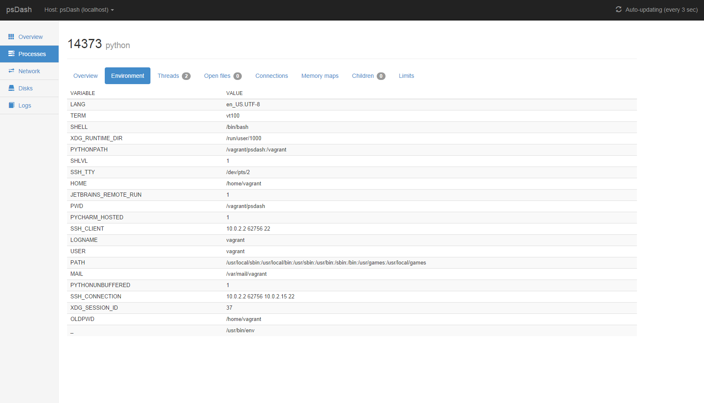
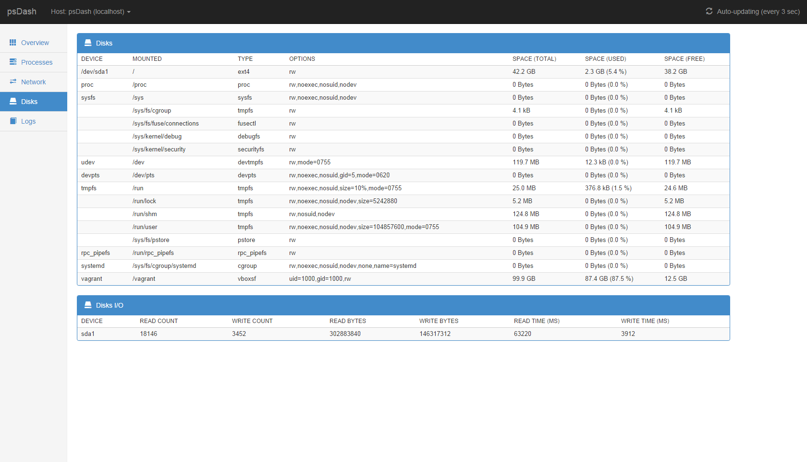

# psdash

[](https://travis-ci.org/Jahaja/psdash)
[](https://coveralls.io/r/Jahaja/psdash?branch=master)

psdash is a system information web dashboard for linux using data mainly served by [psutil](https://code.google.com/p/psutil/) - hence the name.

* [Features](#features)
* [Installation](#installation)
* [Getting started](#getting-started)
* [Configuration](#configuration)
* [Screenshots](#screenshots)
* [License](#license)

## Features

* **Overview**<br>
  Dashboard overview of the system displaying data on cpu, disks, network, users, memory, swap and network.
* **Processes**<br>
    List processes (`top` like) and view detailed process information about each process.

    Apart from a detailed process overview this is also available for each process:
    * Open files
    * Open connections
    * Memory maps
    * Child processes
    * Resource limits
* **Disks**<br>
    List info on all disks and partitions.
* **Network**<br>
    List info on all network interfaces and the current throughput.
    System-wide open connections listing with filtering. Somewhat like `netstat`.
* **Logs**<br>
    Tail and search logs.
    The logs are added by patterns (like `/var/log/*.log`) which are checked periodically to account for new or deleted files.
* **Multi-node/Cluster**
    Support for multiple agent nodes that is either specified by a config or will register themselves on start-up to a common psdash node that runs the web interface.
* **All data is updated automatically, no need to refresh**

The GUI is pretty much a modified bootstrap example as I'm no designer at all.
If you got a feel for design and like to improve the UI parts of psdash, please create a pull request with your changes.
It would be much appreciated as there's much room for improvements.

## Installation

Make sure your system is able to build Python C extensions. On Debian derivatives such as Ubuntu this should translate to installing the `build-essential` and `python-dev` packages using `apt-get`:

`# apt-get install build-essential python-dev`

And on RHEL (Fedora, CentOS etc.) distributions:
```
# yum groupinstall "Development Tools"
# yum install python-devel
```

Installation using pip:<br>
`$ pip install psdash`

Since pip [1.5.1](https://github.com/pypa/pip/issues/1423) you are forced to add `--allow-external argparse` since the latest argparse is hosted on google code.

Installation from source:<br>
`$ python setup.py install`

## Getting started

Starting psdash:<br>
`$ psdash`

Starting a psdash agent:<br>
`$ psdash -a --register-to [host]:[port] --register-as my-agent-node`

This will start psdash in *agent mode* and try to register the node to the main psdash node pointed to by the `--register-to` option.
An agent node will setup an RPC server rather than a webserver at the host and port specified by `-p/--port` and `-b/--bind` respectively.
The main psdash node (serving HTTP) will present a list of registered nodes that are available to switch between.

Available command-line arguments:
```
$ psdash --help
usage: psdash [-h] [-l path] [-b host] [-p port] [-d] [-a]
              [--register-to host:port] [--register-as name]

psdash [version] - system information web dashboard

optional arguments:
  -h, --help            show this help message and exit
  -l path, --log path   log files to make available for psdash. Patterns (e.g.
                        /var/log/**/*.log) are supported. This option can be
                        used multiple times.
  -b host, --bind host  host to bind to. Defaults to 0.0.0.0 (all interfaces).
  -p port, --port port  port to listen on. Defaults to 5000.
  -d, --debug           enables debug mode.
  -a, --agent           Enables agent mode. This launches a RPC server, using
                        zerorpc, on given bind host and port.
  --register-to host:port
                        The psdash node running in web mode to register this
                        agent to on start up. e.g 10.0.1.22:5000
  --register-as name    The name to register as. (This will default to the
                        node's hostname)
```

## Configuration

psdash uses the configuration handling offered by Flask.
The configuration file pointed to by the environment varible `PSDASH_CONFIG` will be read on startup.<br>
e.g: `$ PSDASH_CONFIG=/home/user/config.py psdash`

In addition to the [built-in configuration values that comes with Flask](http://flask.pocoo.org/docs/config/#builtin-configuration-values) there's a number of psdash specific ones as well:

| Name | Description |
| ---- | ----------- |
| `PSDASH_AUTH_USERNAME` | When this value and `PSDASH_AUTH_PASSWORD` is set, Basic Authentication will be enabled with the provided credentials. The username of the basic authentication |
| `PSDASH_AUTH_PASSWORD` | The password of the basic authentication |
| `PSDASH_ALLOWED_REMOTE_ADDRESSES` | If this is set, only provided ip addresses will be allowed to access psdash. Addresses is separated by a comma. e.g: `PSDASH_ALLOWED_REMOTE_ADDRESSES = "10.0.0.2, 192.29.20.2"` |
| `PSDASH_URL_PREFIX` | This can be used to make psdash serve from a non-root location. e.g: `PSDASH_URL_PREFIX = "/psdash"` would make psdash serve it's pages from /psdash |
| `PSDASH_LOG_LEVEL` | The log level set for psdash (passed in to `logging.basicConfig`). *Defaults to `logging.INFO`*. |
| `PSDASH_LOG_LEVEL` | The log format set for psdash (passed in to `logging.basicConfig`). *Defaults to `%(levelname)s | %(name)s | %(message)s`*. |
| `PSDASH_NODES` | A list of psDash agent nodes to register on startup. e.g `['10.0.0.2:5000', '10.0.20.1:5000']` |
| `PSDASH_NET_IO_COUNTER_INTERVAL` | The interval in seconds to update the counters used for calculating network traffic. *Defaults to 3*. |
| `PSDASH_LOGS_INTERVAL` | The interval in seconds to reapply the log patterns to make sure that file-system changes are applied (log files being created or removed). *Defaults to 60*.
| `PSDASH_REGISTER_INTERVAL` | The interval in seconds to register the agent to the host psdash node. This is done periodically to be able to determine if any node has gone away and at what time. *Defaults to 60* |
| `PSDASH_LOGS` | Log patterns to apply at startup. e.g `['/var/log/*.log']`. To override this option using the command-line use the `-l/--log` arg option. |
| `PSDASH_REGISTER_TO` | When running in agent mode, this is used to set which psdash node to register the agent node to. e.g `http://10.0.20.2:5000`. |
| `PSDASH_REGISTER_AS` | When running in agent mode, this is used to set the name to register as to the host psdash node specified by `PSDASH_REGISTER_TO`. |
| `PSDASH_HTTPS_KEYFILE` | Path to the SSL key file to use to enable starting the psdash webserver in HTTPS mode. e.g `/home/user/private.key`
| `PSDASH_HTTPS_CERTFILE` | Path to the SSL certificate file to use to enable starting the psdash webserver in HTTPS mode. e.g `/home/user/certificate.crt`
| `PSDASH_ENVIRON_WHITELIST` | If set, only the env vars in this list will be displayed with value. e.g `['HOME']`

## Screenshots

Overview:

Listing processes:

Overview of a process:

Connections of a process:

Environment of a process:

Network:

Disks:

Tailing a log:

Searching a log:


## License
Released under CC0 (Public Domain Dedication).

http://creativecommons.org/publicdomain/zero/1.0/
